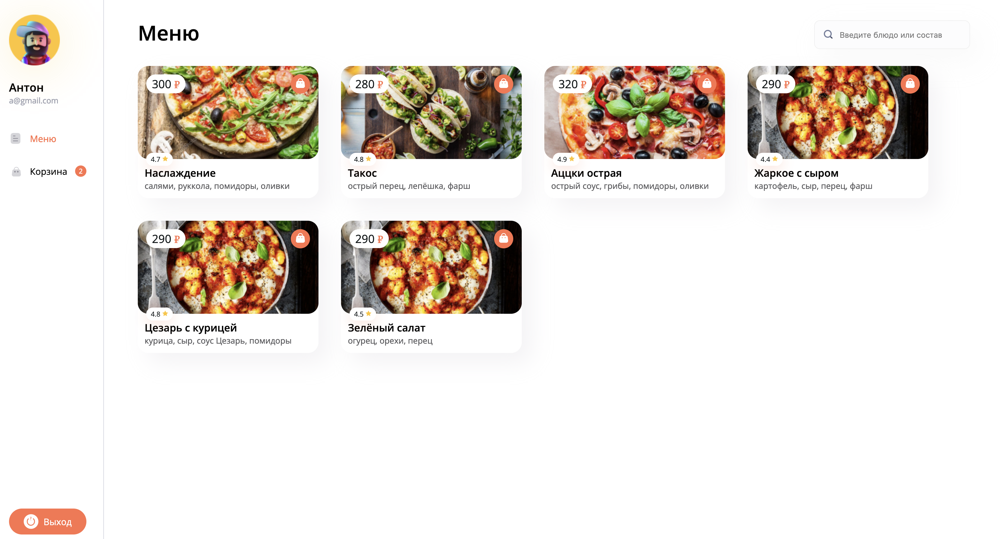
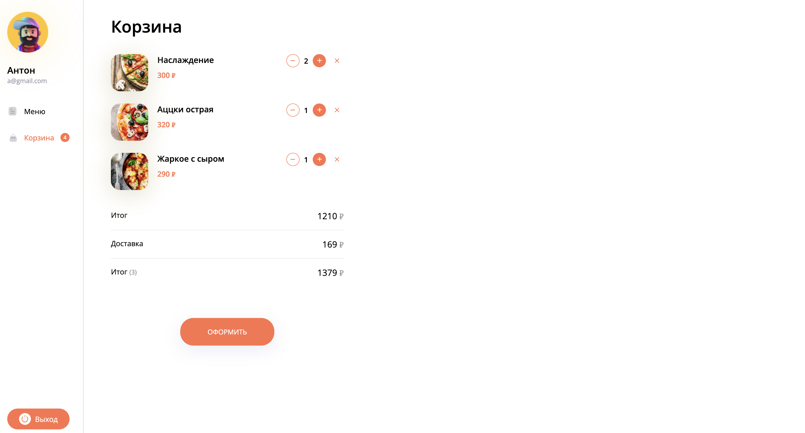

# Приложение для заказа пиццы
Приложение работает через API и позволяет: создавать пользователя, проходить авторизацию и добавлять в корзину желаемые блюда с расчетом стоимости заказа.

В API лежат данные о блюдах и зарегистрированные пользователи.
Авторизация реализована через JWT токен.

Состояние авторизованного пользователя и корзины хранятся в Redux.




## Содержание
- [Технологии](#технологии)
- [Начало работы](#начало-работы)

## Технологии
- [React](https://react.dev/)
- [Vite](https://vitejs.dev/)
- [Redux Toolkit](https://redux-toolkit.js.org/)

## Начало работы

### Требования
Для установки и запуска проекта, необходим [NodeJS](https://nodejs.org/).

### Установка зависимостей
Для установки зависимостей, выполните команду в папке с проектом:
```sh
$ npm i
```

### Запуск Development сервера
Чтобы запустить сервер для разработки, выполните команду в папке с проектом:
```sh
npm run dev
```
После запуска появится данные. Нам нужно поле "Local:", переходим по указанной в нем ссылке и пользуемся приложением.

